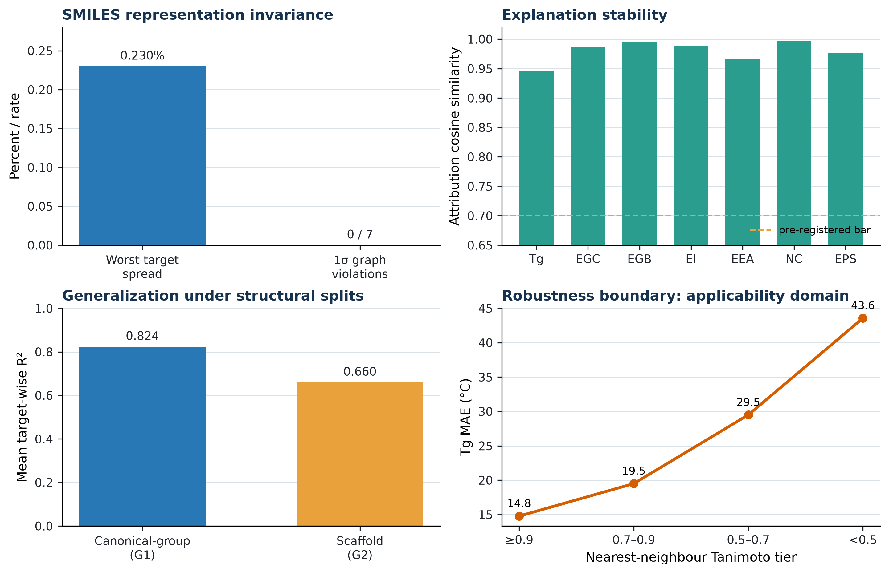

# Mid-Point Check-in: AI for Science & Engineering

**Project:** Physics-guided polymer property prediction from repeat-unit SMILES  
**Team:** Sandman *(confirm official spelling before export)*  
**Metric:** unweighted mean of seven target-wise R² values

We predict glass-transition temperature (Tg), chain and bulk bandgaps (Egc, Egb), ionisation energy (Ei), electron affinity (Eea), refractive index (n), and dielectric constant (ε) from repeat-unit SMILES. The submitted notebook recorded mean R² **0.907551** on the local held-out verification panel and **0.920** on the public leaderboard. The leaderboard result is a frozen outcome; modelling decisions use structure-aware validation, not leaderboard iteration.

## 1. Proposed Strategy & Technical Novelty

### Architecture: specialised prediction lanes with guarded scientific structure

**Figure 1. Pipeline architecture.** Complementary molecular representations feed target-specific learners; validated physical relations are applied only when their required training-time measurements are available. The final out-of-fold non-negative least-squares assembly combines complementary models without cancellation-prone negative weights [1].

One pooled raw-loss model is inappropriate here: Tg supplies 55.9% of evaluation rows and 99.986% of pooled target variance, whereas every target is worth one-seventh of the contest metric. We therefore use seven linked, target-specific lanes rather than allow the high-row-count Tg task to dominate low-data electronic and optical targets. Tree models are a strong small-tabular-data starting point [2]; a compact GINE graph lane is kept only as a decorrelated ensemble member, not as a blanket claim that deep learning is superior [3,4].

| Stage | Design choice | Why it is retained |
|---|---|---|
| Represent | RDKit descriptors, Morgan counts, polymer atomic triples and a small character residual | separates global chemistry, local motifs and polymer-specific environments [5–7] |
| Predict | target-specific tree, kernel, neural and graph lanes selected by grouped CV | target sample sizes and mechanisms differ substantially |
| Constrain | availability-guarded Egc/Ei/Eea, Egb/Egc and ε/n routes | makes cross-property structure testable without target leakage |
| Assemble | out-of-fold NNLS blending | improves complementary predictions while limiting stack overfit [1] |
| Communicate | nearest analogue and applicability tier | structural novelty is visible rather than hidden behind one number [8] |

### Featurisation and scientific reasoning

Features were retained because a targeted ablation showed a loss, not simply because they were available. RDKit descriptors encode size, ring content, polarity and flexibility proxies; Morgan counts encode local functional environments; and Polymer Genome-style atomic triples encode polymer-specific local environments [5–7]. In grouped-CV proxy tests, removing RDKit descriptors lowered Egb from 0.856 to 0.830 and Ei from 0.794 to 0.756; removing Morgan counts lowered n from 0.787 to 0.767. Atomic triples improved targeted Egb from 0.917 to 0.926 and n from 0.844 to 0.852. Character n-grams are deliberately a limited residual channel: SMILES order is notation, not material physics.

We also tested narrow physical routes instead of assuming them. Egc agreed with Ei−Eea on 59 co-measured polymers (R² 0.9716; MAE 0.0716 eV), but a learned residual failed leave-one-out evaluation (R² −0.82) and was rejected. For Egb, an affine Egc route on 175 co-measured structures was improved from 0.9205 to 0.9478 by an ExtraTrees residual, so that correction was retained. For ε, predicting the ionic/polar remainder in ε=n²+ionic gave a non-negative remainder in all 134 audited co-measured cases and a 2.62× better-conditioned problem. These are guarded, tested reductions of the learning problem—not generic formula substitutions.

### Qualitative validation: invariance, explainability, generalisability and robustness

**Figure 2. Qualitative evidence beyond the score.** The upper panels test two different effects of alternative valid SMILES spellings; the lower panels show performance under stricter structural splits and the Tg error increase with structural distance from training chemistry.

**Invariance.** SMILES is a notation, not the polymer. On valid alternative spellings of the same repeat-unit graph, the graph-derived prediction has zero 1σ violations across all seven targets; its largest recorded spread is only 0.230% of that target’s training-standard-deviation scale. Attribution cosine similarity is 0.947–0.996 (mean 0.980). This proves invariance only for equivalent graph spellings—not for changed chemistry, stereochemistry, molecular weight or processing history [9].

**Explainability.** TreeSHAP supplies feature attributions [10]. We test their fidelity rather than treating a colourful ranking as causality: in the Tg proxy, masking the top 10% SHAP-ranked features lowers R² by 0.851, compared with 0.043 for a matched random mask. The ranking is therefore load-bearing for this model intervention, while remaining a hypothesis about chemistry rather than proof of a causal mechanism [11].

**Generalisability and robustness.** A structural generalisation ladder records mean R² 0.824 on canonical-group holdout and 0.660 on scaffold holdout; all seven targets remain positive in both regimes. The expected decline identifies the boundary between familiar and novel polymer families, not a failure hidden by random validation. The demo exposes nearest analogue and an applicability tier because Tg error increases smoothly with decreasing structural similarity. This makes robustness a stated operating condition, rather than an unsupported claim of universal extrapolation [12].

## 2. Preliminary Salient Results

The headline mean R² is **0.907551** on the local held-out verification panel and **0.920** on the public leaderboard. The score is the arithmetic mean of seven target-wise R² values; it is not a pooled R² dominated by Tg. A separately recorded compact verification model ranges from 0.871 (Ei) to 0.927 (Egb), mean 0.902509. It is reported as a diagnostic model, not substituted for the submitted assembly.

**Figure 3. Explanation-fidelity intervention.** Removing features selected by the model’s attribution ranking is far more damaging than removing equally many random features. This is the report’s evidence for predictive explanation fidelity.

The system supports candidate prioritisation rather than a black-box score. For electronic candidates, band-edge predictions can be checked for consistency; for optical candidates, ε is separated into n² and ionic/polar hypotheses; for Tg, rigidity, ring content and flexibility form testable hypotheses about segmental mobility. A proposed polymer remains an experimental candidate, particularly when its nearest analogue is distant.

## 3. Technical Challenges & Pivots

| Challenge / test | Observation | Decision |
|---|---|---|
| scarce, uneven target labels | pure ExtraTrees baseline: grouped-CV mean R² 0.816344 | retain specialised classical lanes and only validated ensemble diversity |
| flexible Egc residual | leave-one-out R² −0.82 | reject it; retain the guarded identity |
| notation-sensitive strings | raw characters can introduce a representation artefact | restrict to residual use; anchor invariance in graph/canonical features |
| uncertainty evidence | archived coverage and error–uncertainty summaries disagree | withhold calibrated-interval claim until the isolated rerun resolves it |

The central limitation is equally clear: repeat-unit SMILES omit molecular-weight distribution, tacticity, morphology, processing history and measurement conditions. The model is therefore for structure-based screening and experimental prioritisation, not a substitute for material characterisation.

## 4. Final Sprint Roadmap and Evaluation Alignment

| Evaluation expectation | How this work addresses it | Final release action |
|---|---|---|
| feature strategy and architecture rationale | ablations, guarded routes, architecture and literature-backed representation choices | freeze feature/route decisions with artifacts |
| polymer invariance | valid-SMILES rewrite prediction and attribution tests | show two equivalent spellings in the dashboard |
| explainability | TreeSHAP plus fidelity intervention; separate electronic/optical mechanisms | group correlated descriptors into chemical concepts and repeat the test |
| generalisability and robustness | grouped/scaffold splits plus similarity-tier boundary | curate a pre-registered external polymer panel with reported conditions |
| transparency | negative results, pure-ML baseline, and withheld uncertainty claim are reported | regenerate uncertainty tables; promote only traceable claims |

Immediate work is to complete the pinned Python-3.11 isolated run, regenerate the late uncertainty evidence tables, and include a parity plot only after its split and source are verified. A reproducible all-classical ExtraTrees pipeline is already available as a transparent alternative; its 0.816344 grouped-CV mean is a baseline under a different protocol, not a direct subtraction from the held-out score [13]. The final deliverable packages the submitted pipeline, environment, evidence tables and an offline dashboard showing structure, prediction, nearest analogue, applicability tier and explanation together. This is the practical research contribution: making the next synthesis or measurement decision more explicit while showing where the model should defer to experiment.

## References

1. Lawson, C. L. & Hanson, R. J. *Solving Least Squares Problems.* SIAM (1995).
2. Grinsztajn, L., Oyallon, E. & Varoquaux, G. Why do tree-based models still outperform deep learning on typical tabular data? *NeurIPS* (2022). https://papers.nips.cc/paper_files/paper/2022/hash/0378c7692da36807bdec87ab043cdadc-Abstract.html
3. Yang, K. *et al.* Analyzing learned molecular representations for property prediction. *J. Chem. Inf. Model.* (2019). https://doi.org/10.1021/acs.jcim.9b00237
4. Krogh, A. & Vedelsby, J. Neural network ensembles, cross validation, and active learning. *NeurIPS* (1994). https://proceedings.neurips.cc/paper/1994/hash/b8c37e33defde51cf91e1e03e51657da-Abstract.html
5. Landrum, G. RDKit: Open-source cheminformatics. https://www.rdkit.org
6. Rogers, D. & Hahn, M. Extended-connectivity fingerprints. *J. Chem. Inf. Model.* (2010). https://doi.org/10.1021/ci100050t
7. Kim, C. *et al.* Polymer Genome: A data-powered polymer informatics platform. *J. Phys. Chem. C* (2018). https://doi.org/10.1021/acs.jpcc.8b02913
8. OECD. *Guidance Document on the Validation of (Q)SAR Models* (2007). https://www.oecd.org/env/guidance-document-on-the-validation-of-quantitative-structure-activity-relationship-q-sar-models-9789264085442-en.htm
9. Bjerrum, E. J. SMILES enumeration as data augmentation for neural network modelling of molecules (2017). https://arxiv.org/abs/1703.07076
10. Lundberg, S. M. & Lee, S.-I. A unified approach to interpreting model predictions. *NeurIPS* (2017). https://arxiv.org/abs/1705.07874
11. Hooker, S. *et al.* A benchmark for interpretability methods in deep neural networks. *NeurIPS* (2019). https://arxiv.org/abs/1806.10758
12. Bemis, G. W. & Murcko, M. A. The properties of known drugs. 1. Molecular frameworks. *J. Med. Chem.* (1996). https://doi.org/10.1021/jm9602928
13. Geurts, P., Ernst, D. & Wehenkel, L. Extremely randomized trees. *Machine Learning* (2006). https://doi.org/10.1007/s10994-006-6226-1

## Appendix A — experiment register

| Theme | Tested result | Decision |
|---|---|---|
| Feature families | RDKit/Morgan removal hurts selected grouped-CV proxy lanes; atomic triples help Egb and n | retain complementary representations |
| Physics route | Egc residual fails LOO; Egb residual improves route; ε decomposition is conditioned | retain only supported guarded routes |
| Invariance | graph-path 1σ violations 0; attribution cosine 0.947–0.996 | make graph/canonical features the invariance anchor |
| Explainability | top-10% SHAP mask loss 0.851 vs 0.043 random | retain intervention-tested explanation scope |
| Pure ML | ExtraTrees grouped-CV mean 0.816344 | retain reproducible baseline, not submission replacement |
| Uncertainty | archived audit conflict | release-gated pending isolated rerun |

## Appendix B — reproducibility and final-export checklist

| Item | Location / condition |
|---|---|
| Submitted pipeline and architecture | `AISEHack-2.0-Sandman-Polymer-Property-Prediction-Codebase/` |
| Isolated reproduction | `fixes/isolated_runs/Sandman_Polymer_Property_Prediction_2_906.ipynb` (Python 3.11.7) |
| Pure-ML baseline | `fixes/pure_ml/VERIFICATION.md` |
| Claim audit | `finals/REPORT_CLAIM_EVIDENCE.md` |
| Public code link | **[Insert final GitHub release URL/tag]** |

Before export, replace the team and repository placeholders, confirm the authorship/GenAI disclosure required by the template, and add the parity plot only after the active isolated run validates it.
